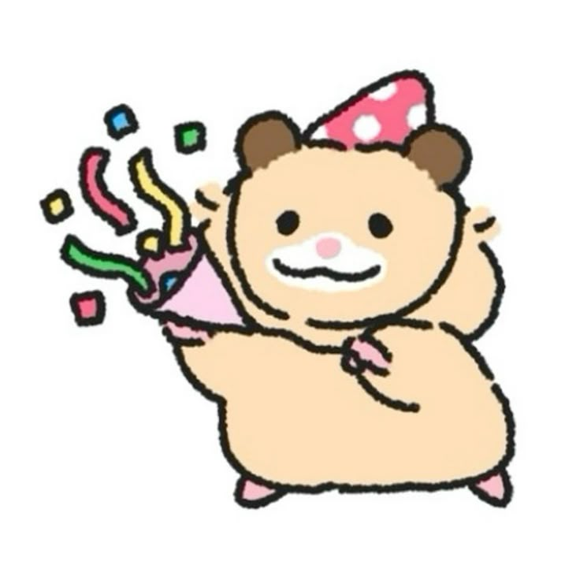

## DA36 FINAL-PROJECT

### • 과정 | PLAYDATA DA-36
### • 팀원 | 이예진(팀장), 김정아, 심정석, 조은비, 전민하, 강한결 

### • 프로젝트 기간 | 2025.01.16 ~ 03.14
### • 프로젝트 주제 | 이미지 인식 기반 베이커리 무인결제 및 매장 관리 시스템
 

## 프로젝트 전체 흐름
- KIOSK 
  - 무인결제시스템을 이용한 키오스크로 트레이에 빵을 담은 후, AI스캐너로 빵을 인식하여 자동으로 결제 목록이 생성되어 이용객이 결제까지 할 수 있는 시스템
- 메인홈
  - 매장의 홈페이지로 회원, 비회원, 관리자까지 공통적으로 볼 수 있는 홈페이지로, '브랜드소개', '매장안내', '메뉴정보', '이벤트', '커뮤니티'를 볼 수 있음
- 마이페이지
  - 회원들만 이용할 수 있으며, '회원정보수정', '비밀번호변경', '결제/취소내역(전자영수증)', '포인트적립내역', '회원탈퇴'를 할 수 있음
- 매장페이지 
  - 매니저(관리자)만 이용할 수 있으며, '매출정보', '재고관리', '메뉴관리', '회원관리', '시스템설정'을 할 수 있음
  
 

 ## 프로젝트 소개

 

 

 

 

 

 

 

 

 

 

 

 

 

 

 

 

 

 

 

 

 

 

 

 

 

 

 

 

 

 

 

 

 

 

 

 

 

 

 

 

 

 

 

 

## 기술스택
- 협업 툴: Git, Github, Notion, Miro, Google Drive, ERD Cloud
- 데이터베이스: MySQL
- 백엔드: Django, Python, Fastapi
- 프론트엔드: HTML, CSS(BootStrap), JS
- 클라우드: AWS (EC2, EB, S3)
- AI 모델 및 도구: OpenCV, TensorFlow, Pytorch, YOLOv8s, Faster R-CNN, Mask R-CNN, Detectron2, Roboflow
- 배포 도구 : Docker, Docker Hub, GitHub Action, Nginx

## 팀원 회고
### 이예진(팀장)
✅ Keep 😃
- 전체적인 기간별로 작업을 할때마다 Team을 나눠서 작업
    - [기획단계] ERD, WBS, 요구사항명세서, 기획서, 화면설계서 등 개인별로 하나씩 자료를 맡고 상황에 따라 필요한 사람들끼리 모여서 같이 작업함
    - [구현단계] AI Team(2), WEB Team(4) 나눠서 작업
        - AI 팀으로 가고 싶어하는 사람들이 더 많았지만 팀내 자체적인 성과발표를 통해 대표 2명을 선발
        - 성과발표 기간동안 web팀(정아, 예진)은 web구현에 필요한 전반적인 구성작업 진행
        
        → 팀이 나눠진후 각자 파트를 나누어 구현 진행
        
        → 팀으로 나눠서 진행하고 다음날 스크럼 회의때 서로 어떤 작업을 했는지 발표하는 형식으로 진행되면서 다른 팀원이 어떤 작업을 하고 있는지 파악을 하면서 구현 작업시 건들여도 되는 파일과 건들면 안되는 파일이 명확해서 충돌이 생각보다 많이 안일어난것 같아서 뿌듯했다.
        
        → 기획단계에서 요구사항 명세서를 작성할 당시에는 사실 ‘이걸 다 구현할 수 있을까..?’란 생각이 엄청 컸었는데 구현단계를 시작하기에 앞서 가장 중요한 부분을 체크함과 동시에 역할을 나누면서 시간을 많이 세이브한것 같고, 시간이 지날수록 모든 팀원들의 실력이 나날이 늘어남으로서 기능을 구현하는 시간이 현저히 줄어들어 초반에 구현하고자 했던 부분을 98%정도 다 구현한 것 같아서 뿌듯하다
        
- 구현기간 1에서 2로 넘어갈때 친할머니 장례로 인해 약 일주일동안 참여를 못했었는데 제가 주말동안 작업해야했던 CI/CD부분을 에러난 상태로 팀원분들께 넘겨드려서 마음이 불편했었습니다. 하지만 팀원분들이 제가 없던 시간동안에도 열심히 구현해주시고 에러났던 부분도 열심히 해결해 주신 덕분에 마음이 한결 가벼워지면서 이 사건을 계기로 팀원분들을 뒤에서 더 잘 서포트 해줄수 있는 팀장이 되기로 마음 먹게 되었습니다
    
    → 마무리 단계에서 에러가 나도 팀원분들이 빠른 시간에 바로바로 해결하시는 모습이 특히 인상깊었습니다
    
- 멘토링을 통해 NABC, SQ=RT 등 새로운 것들을 배우고 프로젝트때 적용을 할 수 있어서 뿌듯했습니다

❌ Problem 😵‍💫
- 구현 초반에 코드 리뷰를 한번은 했었어야 했는데 못했던게 프로젝트 내내 마음에 걸렸었고, 결국 그 부분으로 인해 한결님께서 kiosk 부분을 넘겨받으셨을 때 어려움을 겪으셨던것 같아 죄송스러웠습니다. 또한, html을 작성할 경우 layout을 사용했는데 초반에 체계가 딱 잡혔있었다면 시간을 더 아낄수 있엇을것 같습니다, 또한 아직 css/js가 완전하게 분리되어있지않고 html에 작성되어있는 파일들이 많습니다. 이러한 경험을 통해 팀프로젝트에서 코드 리뷰가 얼마나 중요한 요소인지 깨닫게 되었고, 코드를 작성할 때도 주석을 작성하는 습관을 들여야겠다고 다시 한번 더 다짐하게 되는 계기가 되었습니다

🥊 Try
- 코드 리뷰하는 시간을 가지자
- layout, html/css/js 등 코드 구성 체계를 초반에 나누고 구현을 시작하자
- 팀의 능력을 최대치로 끌어 올릴 수 있게 계획을 잘 세우자

### 김정아
✅ Keep 😃
- 계획 시 구체적인 내용을 작성함으로써 구현단계에서 진행하기가 수월했음
- 의견을 많이 나눔으로써 진행하는데 팀원 모두 이해하고 동의하여 수월하게 진행함
    - 추가 팀 작업에 적극적으로 참여한 점(시장조사, 멘토링)
- 계획한 구현목표들을 거의 구현함
    - 계획 시 할 수 있다라는 마음이 더 컸다가 구현할 내용일 많다보니 중간부터 할 수 있을까? 라는 마음이 있었지만 다들 꾸준히 노력한 덕분에 거의 모든 기능을 구현할 수 있었음
- 멘토링에서 배운 잘 활용하기(NABC같은!)

❌ Problem 😵‍💫
- 진행하면서 생긴 오류 이슈들을 작성하지 못함
- 이슈 작성을 꾸준히 하지 못함
- 코드 작성 시  js와 css 정리 미흡
- 하나의 기능 구현을 위해 작성해야할 파일들이 많다보니 작성하다 헷갈려짐(urls, models, views, html, js, css)
- 담당 외 다른 코드에 대한 이해도가 부족함 - 팀원들의 코드를 보며 다시 공부하기

🥊 Try
- 최종 프로젝트에 구현하지 못한 기능 구현해보기
- 팀원 코드 공부하기

### 심정석
✅ Keep 😃
- 멘토님한테 배웠던 Action Item과 Risk Mitigation (Scope x Quality = Resource x Time) 잘 숙지하기 (취업후 에도 유용하게 쓸듯)
- 기획 단계부터 세세하게 구체적으로 단계별로 기획했던 부분 (NABC 관점에서 진행)
- 실력이 부족해서 팀원들 발목을 붙잡지 않으려고 열심히 노력을 했고 팀원분들이 잘 격려해주셔서 노력한 만큼의 결과가 나온거 같다

❌ Problem 😵‍💫
- 왜 기획자랑 개발자랑 싸우는지 깨달음…
- gpt, claude, grok 등 다양한 AI 를 사용하다보니 코드가 꼬이거나 어디서부터 에러가 나는지 원인을 찾기가 어려움 (백업과 디버깅의 중요성을 다시한번 깨달음…)
- 결국 초기화 하고 처음부터 다시 진행 (시간 버림)

🥊 Try
- 잘 작동하는 코드는 따로 백업을 해 놓고 문제 발생시 비교하면서 수정하거나 진행
- 특히 웹쪽에서 진행하는 경우 `console.log`를 이용해서 디버깅을 병행
- 코드 리뷰

### 조은비🥨

✅ Keep 😃
- **협업을 통한 성장**
  
  데일리 스크럼으로 구현 방식과 실제 서비스 도입 가능성에 대해 지속적으로 논의하며 이해도가 크게 향상했다.
  에러가 생기면 서로 공유하고, 포기하지 않고 함께 원인을 분석하며 해결하는 분위기였다. 새로운 에러는 기록해놨다가 나눴다.
  힘들 때 돕고 해결됐을 때 함께 기뻐했던 협업 경험이 앞으로도 소중하게 기억될 것 같다.

- **AI 서비스 웹앱 개발의 즐거움**
  
  시스템 흐름을 이해하고 Django 프레임워크 기능이나 Ajax 등을 활용해 원하던 기능을 데이터와 연결해 CRUD로 하나씩 구현해가는 과정이 즐거웠다.
  AI 기능이 웹 서비스로 연결되는 과정에도 큰 흥미를 느꼈다. 챗봇 기능을 Django-FastAPI-LangChain로 적용하는 경험을 했는데, 나중에 시스템 아키텍처를 PPT로 만들면서
  다른 팀원의 AWS EC2, Docker나 DB 등이 어떻게 연결되고 작동하는지 더 깊게 이해할 수 있었다.
  이처럼 다양한 도구들이 하나의 웹 서비스로 연결되는 과정이 흥미로웠다.
  이 외에 인상적이었던 경험은 static 디렉토리가 아닌 S3 버킷을 통해 이미지 연동 하려고 했던 경험이다. 작동 방식을 이론으로만 이해한 상태에서 처음으로 시도했었는데
  생각했던 대로 단팥빵 사진이 홈페이지 상품 안내창에 나왔을 때는 단순한 출력 이상의 감동을 느꼈다. 단팥빵 사진을 보면서 감동을 느낄 일이 인생에 있을 줄 몰랐다.

- **개발환경배포 CI/CD**
  
  프로젝트 기간 동안 EC2와 MySQL을 연결해 개발DB를 구분했었는데, 프로젝트 발표날 최종 피드백에서 개발 전용 배포 환경이 필요하다는 조언을 받았고,
  이후 Nginx, Docker, GitHub Actions를 활용해 **개발 전용 배포 환경**을 CI/CD로 구축했다. 개발용 도메인과 SSL을 설정하고, `.env`파일로 공유하던 DB 계정 등의 환경변수 정보를 EC2에 저장했다.
  [자세한 구현 과정 보기](https://velog.io/@jovy/개발배포환경)

- **기록의 중요성**
  
  말로만 상황을 전달할 때는 서로 다르게 이해하는 경우가 왕왕 있었는데, 커밋 메시지, 이슈, Notion, velog 등에 상세히 기록한 경우 더 빠르게 문제를 공유하고 해결할 수 있었다.

❌ Problem 😵‍💫
- **부족한 프레임워크 기능 활용**
  
  팀원 모두 밤잠을 줄이며 노력했지만, 시간은 부족했다. 주요 기능 구현에 집중한 덕분에 기본 동작은 완성했지만, 데이터나 프레임워크를 깊이 이해하고 활용하지는 못했다. 더 보완하고 싶은 부분이다.

- **YOLOv8 경계 인식 성능 개선 시도**

  초반에 '질감, 경계를 강조한 이미지셋으로 YOLO의 경계 인식 성능을 개선할 수 있지 않을까?'라는 궁금증이 생겼다.
  Gabor, Edge/Contour Detection 등으로 질감과 윤곽을 강조한 이미지셋을 생성해 YOLO 학습에 적용해보려 했지만,
  Colab 런타임 제약과 시간 부족 이슈로 실험해보지 못했고, 실험 데이터를 남겨 후속 개선에 활용할 수 있도록 준비해놨다.

- **LangChain 활용 부족**
  
  랭체인의 여러 기능을 활용해보고 싶었지만 못해서 아쉬웠다. 이번에는 단순 적용에 그쳤지만 앞으로의 개선 작업에 도움이 될 것이라고 생각한다.

- **바이브코딩의 한계**
  
  내가 다 해냈다고 생각하지 않는다. 혼자 공부한대로 코드를 작성해서 돌려보고, 에러를 해결해보려고 하다가, 너무 지체된다 싶으면 chatGPT, cluade를 사용했다.
  AI는 아무리 고민하고 찾아봐도 해결이 안 되던 부분을 뚝딱 해결해주고 내가 이해할 수 있게 설명까지 해줬다. 하지만 사용할수록 오히려 한계를 느꼈다.
  바이브코딩은 시간을 줄여주는 것 같았지만, 결국 내가 아키텍처 흐름이나 로직을 생각하려는 힘, 프레임워크를 깊게 활용하려는 작업에는 방해가 된 것 같다.

🥊 Try
- **기본기를 쌓아서 스스로 사고하는 개발자가 되길**
  
  기본기부터 다시 쌓아서 내 코드를 더 효율적으로 개선해보고 싶다.
  스스로 사고하는 개발자가 되고 싶다. 원리를 깊게 이해하고 구현하고 싶다. 그러려면 할 공부가 매우 많아보인다. 개발 언어와 프레임워크에도 더 익숙해져야겠지만 기본적으로 수학, 알고리즘, CS 공부가 필요하다고 느낀다.

### 전민하
✅ Keep 😃
- 욕심이 현실이 되는 경험을 하면서 성장을 체감함
- 좋은 팀원들의 배려를 받으며 AI 관련 파트를 이어갈 수 있었음
- 많은 요구사항들이 구현된 게 뿌듯했고, 멘토링을 통해 기획과 설명력의 중요성을 깨달음
- 웹 프론트엔드의 재미를 느낌
- 노력한 만큼 결과가 나와서 기분이 정말 좋음
- 서로의 부족한 점을 보완하며 협업이 잘 됨

❌ Problem 😵‍💫
- 시간 분배가 아쉬웠고, 클로드 코드 리뷰가 필요함
- 내가 담당하지 않은 부분에 대한 이해 부족
- 질문하는 능력이 부족하다는 피드백
- 이슈 관리를 꾸준히 못함
- 칭찬 외의 피드백이 기억에 남지 않음

🥊 Try
- 모르면 피하지 말고 바로 시작해야 함! 

### 강한결
 
✅ Keep 😃

- 많~이 열심히 했고, 그 노력이 아깝지 않게 좋은 결과물을 냈다
    - 팀원 모두 정말 열심히 했다는 걸 알아서 발표가 부담스럽고 떨렸는데 잘 마무리했다
    - 잘 다듬으면 실제로 서비스할 수 있을 것 같고, 그렇지 않더라도 사용한 기술이나 아이디어를 다른 서비스로 확장할 여지가 많아서 더 만족스럽다
    
- 처음부터 끝까지 계획을 크게 벗어나지 않고 꾸준히, 밀도 있게 프로젝트를 진행했다
    - 항상 작업의 우선순위와 데드라인을 잘 정해놓고 일해서 일정 관리가 잘 되었다
      
- 팀원간 작업상황이나 의견 공유가 활발하고 원활하게 잘 이루어졌다
  
- 어려워보이는 일도 단계별로 잘 해결해나갈 수 있다는 자신감이 생겼다
    - 오류가 생겼을 때 스스로 디버깅해가며 원인을 찾아나가는게 익숙해지고 있다
    - 더 잘하고 싶다. 향상심이 커졌다
      
❌ Problem 😵‍💫
- 프로젝트 막판 시간 관리에 실패해서 완성도가 다소 아쉬운 산출물(Object Detection 기술 검증 비교 선택 분석서, 발표자료 등)이 있다
- 기획 단계에서 사용할 기술이나 모델들을 가볍게 테스트해봤으면 덜 헤맸을 것 같다
- AI가 작성해준 코드를 다 이해하지 못한 채로 넘어간 경우가 좀 있었는데 결국 그렇게 아낀 시간을 디버깅할 때 다 뱉어내야 했다
- 프로젝트가 끝나고 나니까 공허하다. 달리던 기차가 멈춘 것 같다..Add commentMore actions

🥊 Try
- 프로젝트 코드 리뷰, 문서 정리를 좀 해야 할 듯
- 새로운 프로젝트를 할 것
- sqld, 빅분기, pcce 응시
- 정처기나 기타 자격증도 빠르게빠르게 딸 듯
  
😄 좋은 팀원들을 만나 두 달 내내 정말 행복하게 지냈습니다. 감사합니다

## 추카포카

 

## DA36기 최종프로젝트 WEB repo
