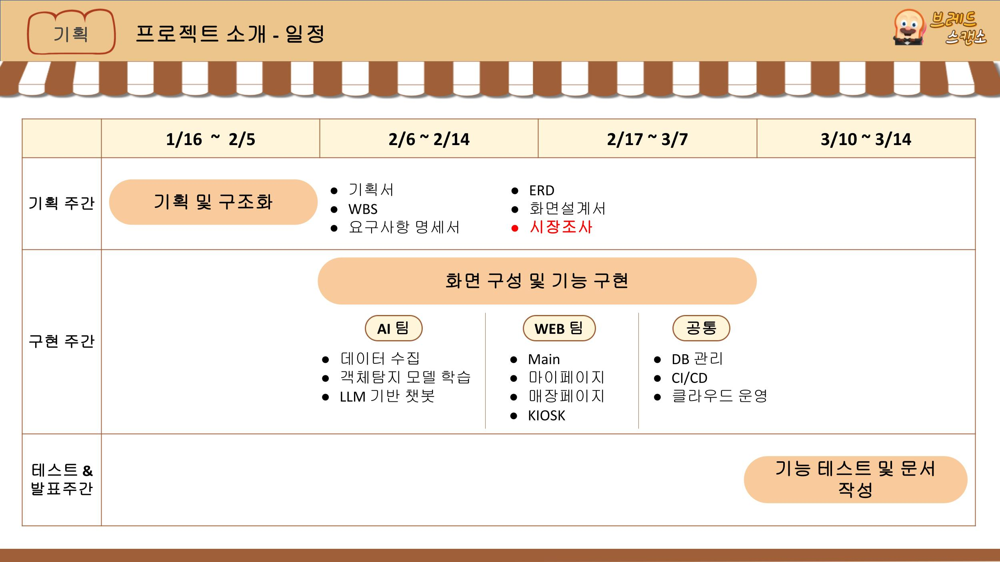
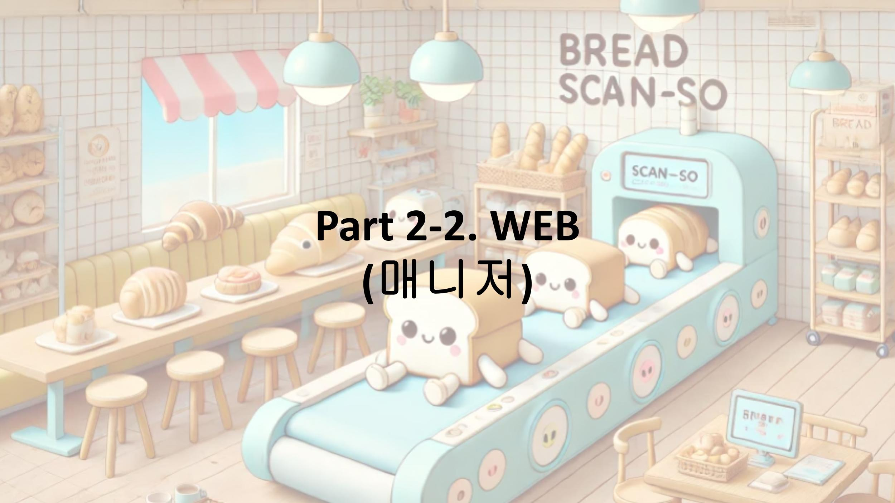
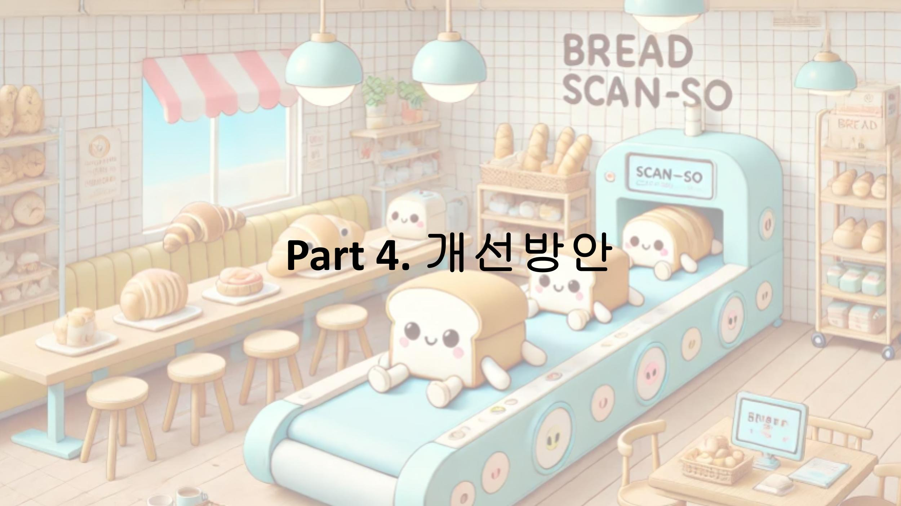

## DA36 FINAL-PROJECT

### • 과정 | PLAYDATA DA-36
### • 팀원 | 이예진(팀장), 김정아, 심정석, 조은비, 전민하, 강한결 

### • 프로젝트 기간 | 2025.01.16 ~ 03.14
### • 프로젝트 주제 | 이미지 인식 기반 베이커리 무인결제 및 매장 관리 시스템
 

## 프로젝트 전체 흐름
- KIOSK 
  - 무인결제시스템을 이용한 키오스크로 트레이에 빵을 담은 후, AI스캐너로 빵을 인식하여 자동으로 결제 목록이 생성되어 이용객이 결제까지 할 수 있는 시스템
- 메인홈
  - 매장의 홈페이지로 회원, 비회원, 관리자까지 공통적으로 볼 수 있는 홈페이지로, '브랜드소개', '매장안내', '메뉴정보', '이벤트', '커뮤니티'를 볼 수 있음
- 마이페이지
  - 회원들만 이용할 수 있으며, '회원정보수정', '비밀번호변경', '결제/취소내역(전자영수증)', '포인트적립내역', '회원탈퇴'를 할 수 있음
- 매장페이지 
  - 매니저(관리자)만 이용할 수 있으며, '매출정보', '재고관리', '메뉴관리', '회원관리', '시스템설정'을 할 수 있음
  
 

 ## 프로젝트 소개

 

 

 

 

 

 

 

 

 

 

 

 

 

 

 

 

 

 

 

 

 

 

 

 

 

 

 

 

 

 

 

 

 

 

 

 

 

 

 

 

 

 

 

 

## 기술스택
- 협업 툴: Git, Github, Notion, Miro, Google Drive, ERD Cloud
- 데이터베이스: MySQL
- 백엔드: Django, Python, Fastapi
- 프론트엔드: HTML, CSS(BootStrap), JS
- 클라우드: AWS (EC2, EB, S3)
- AI 모델 및 도구: OpenCV, TensorFlow, Pytorch, YOLOv8s, Faster R-CNN, Mask R-CNN, Detectron2, Roboflow
- 배포 도구 : Docker, Docker Hub, GitHub Action

## 팀원 회고
### 이예진(팀장)
✅ Keep 😃
- 전체적인 기간별로 작업을 할때마다 Team을 나눠서 작업
    - [기획단계] ERD, WBS, 요구사항명세서, 기획서, 화면설계서 등 개인별로 하나씩 자료를 맡고 상황에 따라 필요한 사람들끼리 모여서 같이 작업함
    - [구현단계] AI Team(2), WEB Team(4) 나눠서 작업
        - AI 팀으로 가고 싶어하는 사람들이 더 많았지만 팀내 자체적인 성과발표를 통해 대표 2명을 선발
        - 성과발표 기간동안 web팀(정아, 예진)은 web구현에 필요한 전반적인 구성작업 진행
        
        → 팀이 나눠진후 각자 파트를 나누어 구현 진행
        
        → 팀으로 나눠서 진행하고 다음날 스크럼 회의때 서로 어떤 작업을 했는지 발표하는 형식으로 진행되면서 다른 팀원이 어떤 작업을 하고 있는지 파악을 하면서 구현 작업시 건들여도 되는 파일과 건들면 안되는 파일이 명확해서 충돌이 생각보다 많이 안일어난것 같아서 뿌듯했다.
        
        → 기획단계에서 요구사항 명세서를 작성할 당시에는 사실 ‘이걸 다 구현할 수 있을까..?’란 생각이 엄청 컸었는데 구현단계를 시작하기에 앞서 가장 중요한 부분을 체크함과 동시에 역할을 나누면서 시간을 많이 세이브한것 같고, 시간이 지날수록 모든 팀원들의 실력이 나날이 늘어남으로서 기능을 구현하는 시간이 현저히 줄어들어 초반에 구현하고자 했던 부분을 98%정도 다 구현한 것 같아서 뿌듯하다
        
- 구현기간 1에서 2로 넘어갈때 친할머니 장례로 인해 약 일주일동안 참여를 못했었는데 제가 주말동안 작업해야했던 CI/CD부분을 에러난 상태로 팀원분들께 넘겨드려서 마음이 불편했었습니다. 하지만 팀원분들이 제가 없던 시간동안에도 열심히 구현해주시고 에러났던 부분도 열심히 해결해 주신 덕분에 마음이 한결 가벼워지면서 이 사건을 계기로 팀원분들을 뒤에서 더 잘 서포트 해줄수 있는 팀장이 되기로 마음 먹게 되었습니다
    
    → 마무리 단계에서 에러가 나도 팀원분들이 빠른 시간에 바로바로 해결하시는 모습이 특히 인상깊었습니다
    
- 멘토링을 통해 NABC, SQ=RT 등 새로운 것들을 배우고 프로젝트때 적용을 할 수 있어서 뿌듯했습니다

❌ Problem 😵‍💫
- 구현 초반에 코드 리뷰를 한번은 했었어야 했는데 못했던게 프로젝트 내내 마음에 걸렸었고, 결국 그 부분으로 인해 한결님께서 kiosk 부분을 넘겨받으셨을 때 어려움을 겪으셨던것 같아 죄송스러웠습니다. 또한, html을 작성할 경우 layout을 사용했는데 초반에 체계가 딱 잡혔있었다면 시간을 더 아낄수 있엇을것 같습니다, 또한 아직 css/js가 완전하게 분리되어있지않고 html에 작성되어있는 파일들이 많습니다. 이러한 경험을 통해 팀프로젝트에서 코드 리뷰가 얼마나 중요한 요소인지 깨닫게 되었고, 코드를 작성할 때도 주석을 작성하는 습관을 들여야겠다고 다시 한번 더 다짐하게 되는 계기가 되었습니다

🥊 Try
- 코드 리뷰하는 시간을 가지자
- layout, html/css/js 등 코드 구성 체계를 초반에 나누고 구현을 시작하자
- 팀의 능력을 최대치로 끌어 올릴 수 있게 계획을 잘 세우자

### 김정아
✅ Keep 😃
- 계획 시 구체적인 내용을 작성함으로써 구현단계에서 진행하기가 수월했음
- 의견을 많이 나눔으로써 진행하는데 팀원 모두 이해하고 동의하여 수월하게 진행함
    - 추가 팀 작업에 적극적으로 참여한 점(시장조사, 멘토링)
- 계획한 구현목표들을 거의 구현함
    - 계획 시 할 수 있다라는 마음이 더 컸다가 구현할 내용일 많다보니 중간부터 할 수 있을까? 라는 마음이 있었지만 다들 꾸준히 노력한 덕분에 거의 모든 기능을 구현할 수 있었음
- 멘토링에서 배운 잘 활용하기(NABC같은!)

❌ Problem 😵‍💫
- 진행하면서 생긴 오류 이슈들을 작성하지 못함
- 이슈 작성을 꾸준히 하지 못함
- 코드 작성 시  js와 css 정리 미흡
- 하나의 기능 구현을 위해 작성해야할 파일들이 많다보니 작성하다 헷갈려짐(urls, models, views, html, js, css)
- 담당 외 다른 코드에 대한 이해도가 부족함 - 팀원들의 코드를 보며 다시 공부하기

🥊 Try
- 최종 프로젝트에 구현하지 못한 기능 구현해보기
- 팀원 코드 공부하기

### 심정석
✅ Keep 😃
- 멘토님한테 배웠던 Action Item과 Risk Mitigation (Scope x Quality = Resource x Time) 잘 숙지하기 (취업후 에도 유용하게 쓸듯)
- 기획 단계부터 세세하게 구체적으로 단계별로 기획했던 부분 (NABC 관점에서 진행)
- 실력이 부족해서 팀원들 발목을 붙잡지 않으려고 열심히 노력을 했고 팀원분들이 잘 격려해주셔서 노력한 만큼의 결과가 나온거 같다

❌ Problem 😵‍💫
- 왜 기획자랑 개발자랑 싸우는지 깨달음…
- gpt, claude, grok 등 다양한 AI 를 사용하다보니 코드가 꼬이거나 어디서부터 에러가 나는지 원인을 찾기가 어려움 (백업과 디버깅의 중요성을 다시한번 깨달음…)
- 결국 초기화 하고 처음부터 다시 진행 (시간 버림)

🥊 Try
- 잘 작동하는 코드는 따로 백업을 해 놓고 문제 발생시 비교하면서 수정하거나 진행
- 특히 웹쪽에서 진행하는 경우 `console.log`를 이용해서 디버깅을 병행
- 코드 리뷰

### 조은비 
✅ Keep 😃
- 생각한대로 잘 안 될 때, 다른 팀원이 작성한 코드를 조금씩 임의로 수정해보는 일이 있었는데, 이때 생각한 건 ‘혼자 수정해보고 push만 안 하면 되겠지’였지만, 다급하게 마무리를 하다보면 내가 임의로 수정해둔 코드를 원복시키지 않고 push를 하게 되는 일이 생기곤 했다. 그래서 다른 팀원이 작성한 코드를 건드리기 전에는 꼭 물어보게 되는 습관이 생긴 것 같다. 이 습관을 그대로 가지고 가고 싶다
- 해결 못할 에러는 없다는 걸 알게 됐다. 단지 그 과정이 조금 고될뿐.. 포기하지.. 말자..
- 여러가지 충돌과 에러를 겪으면서 테이블 참조,  django, aws, s3, fastapi 등 낯설었던 내용에 조금 더 익숙해졌고, 시스템 구조와 흐름에 대해 알게 됐다
- 사이트에서 메뉴 확인하기, 결제내역 확인하기, 전자영수증, 회원가입, ID/비번 찾기, 프로필사진 수정 등 평소에 우리가 쉽게 접하던 간단해 보이던 것들도 정말 복잡한 기능들이 포함됐다는 걸 알게됐다. 하나 하나 구현이 되는 걸 보거나, 직접 해낼 때 뿌듯했다
- 이슈 정리부터 하고 작업을 하려는 걸 하려고 애를 썼는데 계속 그걸 유지하지는 못했지만 그래도 저번 프로젝트들 보다는 잘 지키려고 애쓴 거 같았다

❌ Problem 😵‍💫
- 너무 많아서 뭐부터 써야할지 모르겠다. 이해를 했다고 여겼는데 전혀 다른 방향으로 이해하고 혼자 오해하고 있을 때가 많았다
- 제일 어이없었던 실수는 openai에 크레딧이 없어서 안 되는 거였는데, django나 fastapi에서 뭘 잘못하고 있는 줄 알고 fastapi랑 django만 7시간 동안 계속 지웠다가 수정했다가 만들었다가 했던 일이었다. 대체 왜 이러는 걸까..
- 내가 다 해냈다고 생각하지 않는다. 혼자 공부한대로 코드를 작성해서 돌려보고, 에러를 해결해보려고 하다가, 너무 지체된다 싶으면 chatGPT를 사용했다. 나는 거들었고 chatGPT와 calud가 더 고생했다.. 사용을 지양해야 한다는 건 알겠지만 아는 게 없으니 더 의존하게 되는 거 같다

🥊 Try
- 할 공부는 정말 많지만, 일단 수업 내용 복습하고 실습문제 다 푸는 것부터 할 생각이다. 원래는 최종 프로젝트 전에 끝났어야 했는데 계획에 져버려서 분하다.. 일단 이것부터 한 다음에, 최종프로젝트에서 아쉬웠던 부분들도 만지작대보고, 부족해보였던 내용들도 조금 더 다듬어보려고 한다
  
😄 팀원들과 했던 수많은 논의와, 해결하지 못할 것 같았던 수많은 에러가 저의 이해도를 많이 높여줬습니다. 그동안 팀원들과 함께 열정적으로 작업할 수 있어서 좋았습니다. 앞으로도 남아있는 수많은 프로젝트에 대한 미련이 저를 성장시켜줄 것 같습니다. 감사합니다! 🙂

### 전민하
✅ Keep 😃
- 욕심이 현실이 되는 경험을 하면서 성장을 체감함
- 좋은 팀원들의 배려를 받으며 AI 관련 파트를 이어갈 수 있었음
- 많은 요구사항들이 구현된 게 뿌듯했고, 멘토링을 통해 기획과 설명력의 중요성을 깨달음
- 웹 프론트엔드의 재미를 느낌
- 노력한 만큼 결과가 나와서 기분이 정말 좋음
- 서로의 부족한 점을 보완하며 협업이 잘 됨

❌ Problem 😵‍💫
- 시간 분배가 아쉬웠고, 클로드 코드 리뷰가 필요함
- 내가 담당하지 않은 부분에 대한 이해 부족
- 질문하는 능력이 부족하다는 피드백
- 이슈 관리를 꾸준히 못함
- 칭찬 외의 피드백이 기억에 남지 않음

🥊 Try
- 모르면 피하지 말고 바로 시작해야 함! 

### 강한결
 
✅ Keep 😃
- 많~이 열심히 했고, 그 노력이 아깝지 않게 좋은 결과물을 냈다
    - 팀원 모두 정말 열심히 했다는 걸 알아서 발표가 부담스럽고 떨렸는데 잘 마무리했다
    - 잘 다듬으면 실제로 서비스할 수 있을 것 같고, 그렇지 않더라도 사용한 기술이나 아이디어를 다른 서비스로 확장할 여지가 많아서 더 만족스럽다
- 처음부터 끝까지 계획을 크게 벗어나지 않고 꾸준히, 밀도 있게 프로젝트를 진행했다
    - 항상 작업의 우선순위와 데드라인을 잘 정해놓고 일해서 일정 관리가 잘 되었다
- 팀원간 작업상황이나 의견 공유가 활발하고 원활하게 잘 이루어졌다
- 어려워보이는 일도 단계별로 잘 해결해나갈 수 있다는 자신감이 생겼다
    - 오류가 생겼을 때 스스로 디버깅해가며 원인을 찾아나가는게 익숙해지고 있다
    - 더 잘하고 싶다. 향상심이 커졌다
    - 
❌ Problem 😵‍💫
- 프로젝트 막판 시간 관리에 실패해서 완성도가 다소 아쉬운 산출물(Object Detection 기술 검증 비교 선택 분석서, 발표자료 등)이 있다
- 기획 단계에서 사용할 기술이나 모델들을 가볍게 테스트해봤으면 덜 헤맸을 것 같다
- AI가 작성해준 코드를 다 이해하지 못한 채로 넘어간 경우가 좀 있었는데 결국 그렇게 아낀 시간을 디버깅할 때 다 뱉어내야 했다
- 프로젝트가 끝나고 나니까 공허하다. 달리던 기차가 멈춘 것 같다..

🥊 Try
- 프로젝트 코드 리뷰, 문서 정리를 좀 해야 할 듯
- 새로운 프로젝트를 할 것
- sqld, 빅분기, pcce 응시
- 정처기나 기타 자격증도 빠르게빠르게 딸 듯
  
😄 좋은 팀원들을 만나 두 달 내내 정말 행복하게 지냈습니다. 감사합니다

## 추카포카

 

